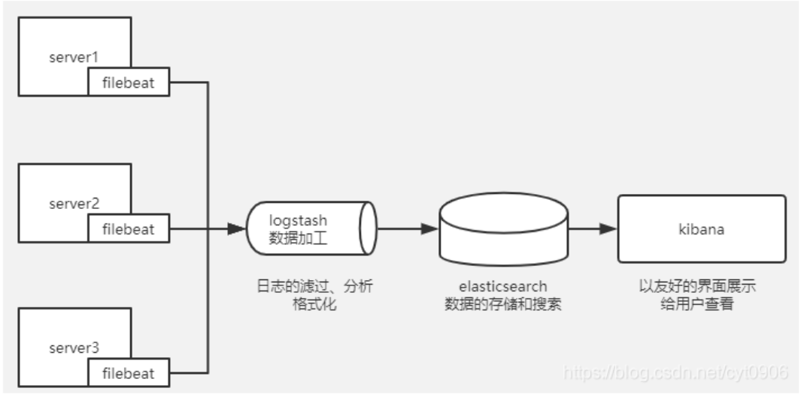
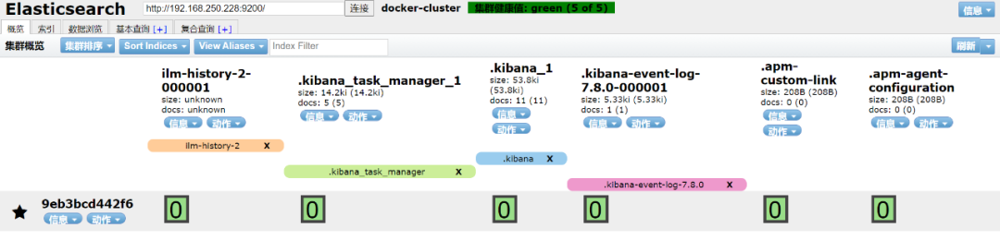
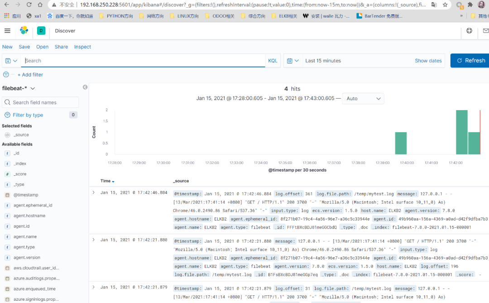

# [采用Docker安装ELK进行Nginx日志分析](https://mp.weixin.qq.com/s/JeGwLvau6oou_bYSdGLoKA)
+ 前提是要装最新的jdk




### 1.安装docker
三、获取ELK镜像
本次测试没有选择最新的ELK7.10.0版本，选7.8.0版本进行部署。

1.镜像加速器
先登录阿里云控制面板，选择容器服务，然后左下角选镜像加速，根据指引进行设置。

设置完成后，进行重启Docker。

``` shell
[root@ELKB2 docker]# pwd

/etc/docker

[root@ELKB2 docker]# vim daemon.json

[root@ELKB2 docker]# cat daemon.json

{

"registry-mirrors": ["https://d69sxpho.mirror.aliyuncs.com"]

}

[root@ELKB2 docker]#

[root@ELKB2 docker]# systemctl daemon-reload

[root@ELKB2 docker]# systemctl restart docker
```
2.拉取镜像
```shell

[root@ELKB2 docker]# docker pull elasticsearch:7.8.0

[root@ELKB2 docker]# docker pull logstash:7.8.0

[root@ELKB2 docker]# docker pull kibana:7.8.0

[root@ELKB2 docker]# docker pull mobz/elasticsearch-head:5-alpine
```
然后查看镜像
```shell

[root@ELKB2 docker]# docker images

REPOSITORY                TAG        IMAGE ID       CREATED        SIZE

logstash                  7.8.001979bbd06c97 months ago   789MB

kibana                    7.8.0      df0a0da46dd1   7 months ago   1.29GB

elasticsearch             7.8.0121454ddad727 months ago   810MB

mobz/elasticsearch-head   5-alpine   e2a76963bc18   3 years ago    78.9MB

[root@ELKB2 docker]#
```
四、安装与配置
修改启动参数

```shell

[root@ELKB2 docker]# vim /etc/sysctl.conf

[root@ELKB2 docker]# sysctl -p

vm.max_map_count = 655300

[root@ELKB2 docker]#
```

1.安装ElasticSearch --> ok 
创建容器并启动

9300：集群节点间通讯接口

9200：客户端访问接口

discovery.type=single-node ：表示单节点启动


创建docker容器挂在的目录

```shell
mkdir -p /opt/elasticsearch/config
mkdir -p /opt/elasticsearch/data
mkdir -p /opt/elasticsearch/plugins
```
我是root 权限运行的，如果你们不是可以在前面加上sudo
注意一定要有权限, 不然启动不了.
chmod 777 -R /opt/elasticsearch

创建elasticsearch.yml文件
```shell
echo "http.host: 0.0.0.0" >> /opt/elasticsearch/config/elasticsearch.yml
echo "transport.host: 0.0.0.0" >> /opt/elasticsearch/config/elasticsearch.yml
echo "cluster.name: my-elasticsearch" >> /opt/elasticsearch/config/elasticsearch.yml
echo "http.cors: true" >> /opt/elasticsearch/config/elasticsearch.yml
echo 'http.cors.allow-origin: "*"' >> /opt/elasticsearch/config/elasticsearch.yml
echo "network.host: 192.168.56.134" >> /opt/elasticsearch/config/elasticsearch.yml
```

启动容器
```shell
docker run -d --name elasticsearch -p 9200:9200 -p 9300:9300 \
-e "discovery.type=single-node" \
-v /opt/elasticsearch/config/elasticsearch.yml:/opt/elasticsearch/config/elasticsearch.yml \
-v /opt/elasticsearch/data:/opt/elasticsearch/data \
-v /opt/elasticsearch/plugins:/opt/elasticsearch/plugins \
 elasticsearch:7.8.0

```

-d：后台启动
--name：容器名称
-p：端口映射
-e：设置环境变量
discovery.type=single-node：单机运行
如果启动不了，可以加大内存设置：-e ES_JAVA_OPTS="-Xms512m -Xmx512m"


//http:localhost:9200 http://0.0.0.0:9200 等一等都会正常 //http://区域网IP:9200  OK
测试：

//http:localhost:9200 http://0.0.0.0:9200 等一等都会正常 //http://区域网IP:9200  OK

```shell
[root@ELKB2 docker]# curl 127.0.0.1:9200

{

"name": "9eb3bcd442f6",

"cluster_name": "docker-cluster",

"cluster_uuid": "mNZ3NzpzTa2yxWviuUZHJA",

"version": {

"number": "7.8.0",

"build_flavor": "default",

"build_type": "docker",

"build_hash": "757314695644ea9a1dc2fecd26d1a43856725e65",

"build_date": "2020-06-14T19:35:50.234439Z",

"build_snapshot": false,

"lucene_version": "8.5.1",

"minimum_wire_compatibility_version": "6.8.0",

"minimum_index_compatibility_version": "6.0.0-beta1"

},

"tagline": "You Know, for Search"

}
```
2.安装kibana--> ok 

```shell
[root@ELKB2 docker]# docker run -d -p 5601:5601--name kibana_es kibana:7.8.0


```shell

docker run -d -p 5601:5601  --link elasticsearch -e  "ELASTICSEARCH_HOSTS=http://192.168.56.135:9200/ kibana:7.8.0

```
cf59435713d75939c97bf963eef76ac14b27117f26e51f47dd20ab2abe998062

[root@ELKB2 docker]#

```


查看日志
```shell
[root@ELKB2 docker]# docker logs -f kibana_es

{"type":"log","@timestamp":"2021-01-15T07:48:27Z","tags":["warning","plugins-discovery"],"pid":7,"message":"Expect plugin \"id\" in camelCase, but found: apm_oss"}

{"type":"log","@timestamp":"2021-01-15T07:48:27Z","tags":["warning","plugins-discovery"],"pid":7,"message":"Expect plugin \"id\" in camelCase, but found: triggers_actions_ui"}
```


docker run -d -p 5601:5601 --name kibana_es kibana:7.8.0

docker logs -f kibana_es

docker exec -i -tt kibana_es bash


ELK--Kibana server is not ready yet完美解决方案


进入到Elasticsearch容器，逐步执行以下代码

curl -u elastic:changeme -XDELETE localhost:9200/_xpack/security/privilege/kibana-.kibana/space_all
curl -u elastic:changeme -XDELETE localhost:9200/_xpack/security/privilege/kibana-.kibana/space_read

注意：
elastic是默认用户名
changeme是默认密码
localhost是你的主机IP，比如192.168.1.1

然后就愉快的登录了


进入kibana容器内修改配置，配置完成后退出容器。

```shell

[root@ELKB2 docker]# docker exec-it kibana_es bash

bash-4.2$ vi config/kibana.yml

bash-4.2$ cat config/kibana.yml

#

# ** THIS IS AN AUTO-GENERATED FILE **

#


# Default Kibana configuration for docker target

server.name: kibana

server.host: "0"

elasticsearch.hosts: [ "http://192.168.250.228:9200"]

monitoring.ui.container.elasticsearch.enabled: true

bash-4.2$ exit

exit
```

重启该容器

docker images ---> images list
docker ps -a ----> container list

docker restart CONTAINER ID 
or docker restart $(docker ps -a -q)

```shell
[root@ELKB2 docker]# docker restart kibana_es

kibana_es

[root@ELKB2 docker]#

```

然后浏览器进行访问
http://192.168.250.228:5601/app/kibana#/home


3. 3.安装Logstash( 内存不足放弃)
创建并启动logstash
```shell
[root@ELKB2 docker]# docker run -d -p 5044:5044--name es_logstash logstash:7.8.0

5c438114407a0e63668ac595d81cd4aa22378d44daeb10707a0d509d977375b4

[root@ELKB2 docker]#

```

进入容器后进行编辑配置


```shell
[root@ELKB2 docker]# docker exec-it es_logstash bash

bash-4.2$ vi config/logstash.yml

bash-4.2$ cat config/logstash.yml

http.host: "0.0.0.0"

xpack.monitoring.elasticsearch.url: [ "http://192.168.250.228:9200"]

xpack.monitoring.elasticsearch.username: elastic

xpack.monitoring.elasticsearch.password: elastic

bash-4.2$
```

修改pipeline下的logstash.conf文件

```shell
[root@ELKB2 docker]# docker exec-it es_logstash /bin/bash

bash-4.2$ ls

bin    CONTRIBUTORS  Gemfile       lib      logstash-core         modules     pipeline  vendor

config    data          Gemfile.lock  LICENSE.txt  logstash-core-plugin-api  NOTICE.TXT  tools     x-pack

bash-4.2$ cd pipeline/

bash-4.2$ ls

logstash.conf

bash-4.2$ vi logstash.conf


bash-4.2$ cat logstash.conf


#input {

#  beats {

#    port => 5044

#  }

#}


#output {

#  stdout {

#    codec => rubydebug

#  }

#}


input {

        file  {

            code=> json

                 path => "/usr/local/*.json"

}

}

filter {

  grok {

    match => { "message"=> "%{DATA:timestamp}\|%{IP:serverIp}\|%{IP:clientIp}\|%{DATA:logSource}\|%{DATA:userId}\|%{DATA:reqUrl}\|%{DATA:reqUri}\|%{DATA:refer}\|%{DATA:device}\|%{DATA:textDuring}\|%{DATA:duringTime:int}\|\|"}

}

}

output {

    elasticsearch {

        hosts=>"http://192.168.250.228:9200"

}

}

bash-4.2$
```

4.安装ElasticSearch-Head

```shell
[root@ELKB2 docker]# docker run -d --name es_admin -p 9100:9100 mobz/elasticsearch-head:5-alpine

13733830b07fb5438336b1513117863187ec0ec4ac381cd5633a7696eac1d910

[root@ELKB2 docker]#
```

测试，进行访问，此时访问失败。

http://192.168.250.228:9100/

这种问题直接配置跨域访问
```shell
# 处理方式1：在创建ES容器时直接指定跨域配置

    docker run -d -p 9200:9200-p 9300:9300-e "http.cors.enabled=true"-e "http.cors.allow-origin=*"-e "discovery.type=single-node"--name elasticsearch elasticsearch:7.8.0


# 处理方式2：进入ES容器内，修改/config/elasticsearch.yml

# 进入ES容器内

    docker exec-it elasticsearch bash

# 编辑config/elasticsearch.yml

    vi config/elasticsearch.yml

# config/elasticsearch.yml添加跨域配置

    http.cors.enabled: true

    http.cors.allow-origin: "*"

# 重启ES容器

    docker restart elasticsearch
```


5.安装filebeat
下载rpm包后安装：
wget https://artifacts.elastic.co/downloads/beats/filebeat/filebeat-7.8.0-x86_64.rpm?_gl=1*1knfkbl*_ga*OTA1Mzg0MTU3LjE2NzUyMTI2NzY.*_ga_Q7TEQDPTH5*MTY3NTMwNzI3Ny41LjAuMTY3NTMwNzQxNS4wLjAuMA..

[root@ELKB2 elk]# rpm -vi filebeat-7.8.0-x86_64.rpm

警告：filebeat-7.8.0-x86_64.rpm: 头V4 RSA/SHA512 Signature, 密钥 ID d88e42b4: NOKEY

软件包准备中...

filebeat-7.8.0-1.x86_64

进行配置


```shell
[root@ELKB2 filebeat-7.8.0]# cat filebeat.yml

filebeat.inputs:

- type: log

      paths:

- /temp/mytest.log

output.elasticsearch:

  hosts: ["http://192.168.250.228:9200"]

[root@ELKB2 filebeat-7.8.0]#

```

启动filebeat

```shell
[root@ELKB2 filebeat-7.8.0]# systemctl start filebeat


```
五.模拟测试
下面模拟日志数据，然后进行测试，成功。

```shell
[root@ELKB2 /]# touch /temp/mytest.log

[root@ELKB2 /]# echo '127.0.0.1-- aaaaa bbb ccc os x  >> /temp/mytest.log

> ^C

[root@ELKB2 /]# echo '127.0.0.1-- aaaaa bbb ccc os x'  >> /temp/mytest.log

[root@ELKB2 /]# echo '127.0.0.1- - [13/Mar/2021:17:41:14+0800] "GET / HTTP/1.1"2003700"-""Mozilla/5.0 (Macintosh; Intel surface  10_11_0) Ao) Chrome/46.0.2490.86 Safari/537.36""-"' >> /temp/mytest.log

[root@ELKB2 /]# echo '127.0.0.1- - [13/Mar/2021:17:41:14+0800] "GET / HTTP/1.1"2003700"-""Mozilla/5.0 (Macintosh; Intel surface  10_11_0) Ao) Chrome/46.0.2490.86 Safari/537.36""-"' >> /temp/mytest.log

[root@ELKB2 /]# echo '127.0.0.1- - [13/Mar/2021:17:41:14+0800] "GET / HTTP/1.1"2003700"-""Mozilla/5.0 (Macintosh; Intel surface  10_11_0) Ao) Chrome/46.0.2490.86 Safari/537.36""-"' >> /temp/mytest.log

[root@ELKB2 /]#
```

